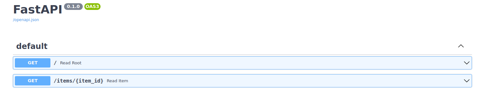

# FastAPI_docker

This is a simple Fast API application which runs in a docker container.


It has only 2 endpoints for a demonstration purposes.



As dependency manager  Poetry library was used.


------------------------------------------------

To build and run app in the container:

- download folder FastAPI_docker
- enter folder
- run: 

```
docker-compose up
```

Enter localhost:0.0.0.0 in your webbrowser.
If any issue appear - try to map different port in docker compose file ( line 12 ).
